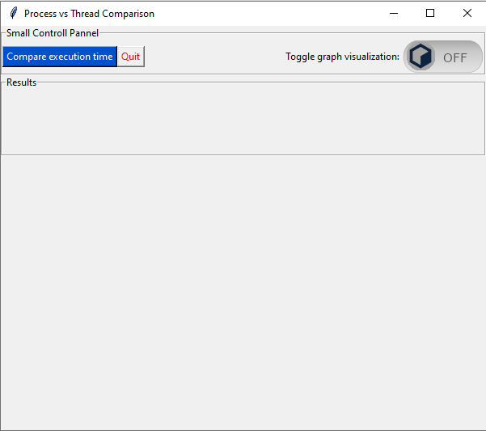
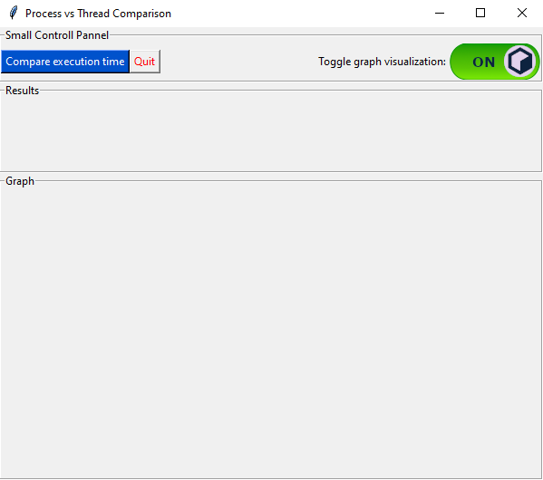
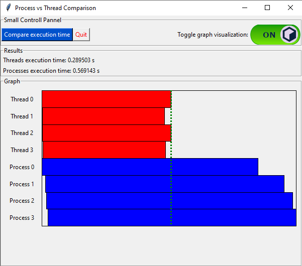
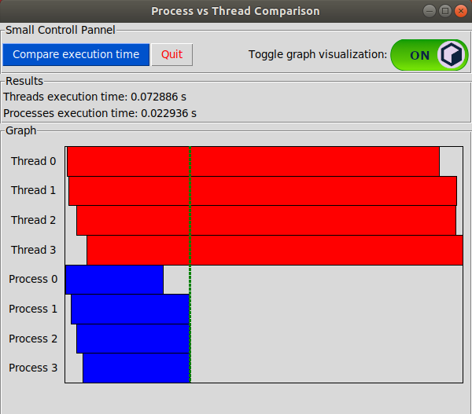

# Program Challenge

## Threads vs. Concurrent Processes

The challenge is to write a Python script to do some Benchmarking. You'll need to use some form of time to grab the time at the start of a code block and the end of the code block. Then, the difference between the two times shows us the speed of execution of this block.

The goal is to measure and compare two methodologies of spawning code to execute from the current script.

In the first block, have your code spawn four threads and measure their parallel execution.  You can measure from start (before first thread started) to finish (after last thread is done).  Each thread should only need to print something out, no need to get too crazy.

In the second block, use a different methodology to run four concurrent processes.  These will be actual processes, so you have to learn about how to make the system call.  Again, these processes should do the exact same thing as the four threads you created in block one.   Again, measure start-to-finish of the four, and report the time.

Finally, print out the comparison of time used.

Questions:   Let me know.
Consult the Internet.  Consult books.   Please do not consult people.   The idea is to assess where you are with Python.

## UI Demo
**Use the toggle button to activate the graphing area**

**Click on "Compare execution time" to compare the execution time of 4 threads vs 4 processes**

**Get the execution time and a nice graph showing when each thread or process started and ended** 

**UI on Ubuntu 18.04**

### Prerequisites
- Python 3.7

### Packages

**Packages used:**
- threading
- multiprocessing
- functools
- time
- random
- collections
- tkinter

    You might have to install tkinter on your system
    e.g: 
    sudo apt-get install python-tk